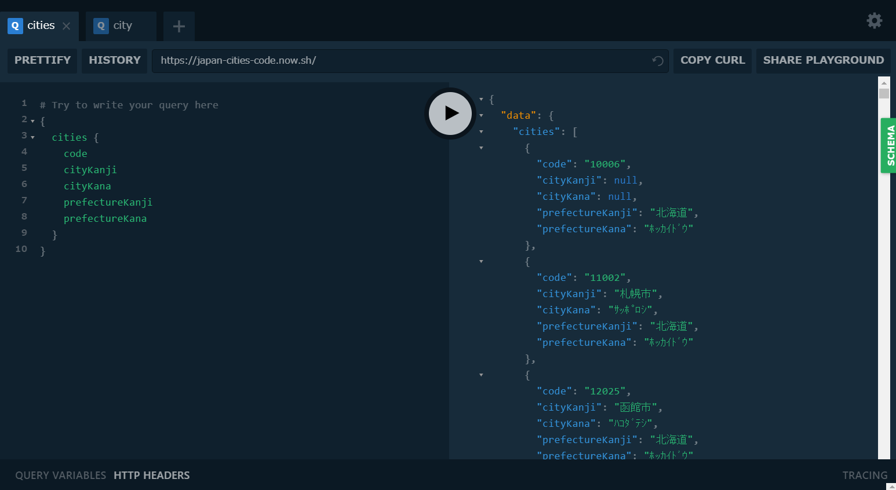

# japan-cities-code-graphql
GraphQL API for Japan cities code by MIC Japan

全国地方公共団体コード（総務省所管）のGraphQL API

## Data source and Licence

http://www.soumu.go.jp/denshijiti/code.html

Licence: cc-by

http://www.data.go.jp/data/dataset/soumu_20140909_0395/resource/dff2cb46-a11e-4879-b5d9-6c4776114e9a

## API 

https://graphqlbin.com/v2/pQPnTz

- cities
- city(name: "origanization name in Japanese Kanji")

Fields

- code
- prefectureKanji
- prefectureKana
- cityKanji
- cityKana

